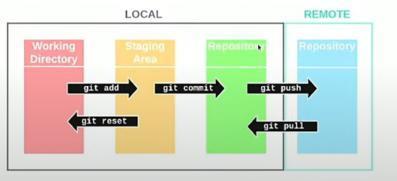
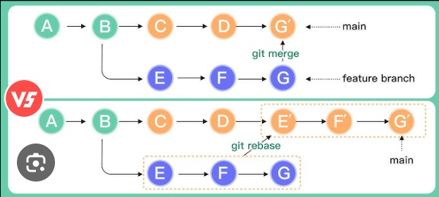

# What is Git

Git areas:
| Area | Explanation |
| - | - |
| Working Area / Directory | Directory with an initialised git-project, where the changes of the project files are not yet tracked. |
| Staging Area | Area with tracked files, where snapshots of the files are added with the command `git add` or removed with `git reset`. This area is needed for preparing a commit. |
| Local repository | Area where commits are located. All changes to the project files that were added to the staging area will go to the local repository with the command `git commit` |
| Remote repository | Area in a cloud repository, such as GitHub, Bitbucket, or GitLab. |




# Basic commands

**Configuring Git**: git's configuration settings can be found in the `.gitconfig` file, which is usually located in the user's home directory. 
```bash
### Check git credentials and settings
git config -l
git config --list
### Set your name and email
git config --global user.name "your name"
git config --global user.email "your-email@gmail.com"

### check which remote is used - https or ssh
git remote -v
### If you want to change the remote, e.g. from https to ssh:
git remote set-url origin <ssh url>
```

Other commands:
```bash
### Check Git version
git --version

### Check flags for a given command
git <command> -help

### Check what files will be added in a command but not actually adding them
git add 'text_transformers/*' --dry-run

### Restore file to before changes as per the state in the last commit
git restore <filename>

### Only add jupyter notebooks in the current directory
git add *.ipynb
### Add notebooks in the current directory or any nested dir
git add '*.ipynb'
```

**A `gitignore` file**

When working on a project, there are often files that you don’t want Git to track, such as log files or files containing sensitive information. This can be managed with a .gitignore file in your repository’s root directory. Patterns defined in this file will apply to all files in the repository.

Example of a `.gitignore` file that ignores all files with extensions `.log` and `.csv`, as well as all files in the `secrets/` directory:
```txt
*.log
*.csv
secrets/*
```

# Basic pipeline

There are a couple of starting points for using Git in your project: 

## Cloning a remote repository

This option implies that there is already a tracked project on GitHub, perhaps because you worked on them before or if you created the files directly on Github.

**To clone a repository from Github** (i.e. creating a local copy of a remote repository), you can use the command `git clone [ssh / https address]`. Cloning is bringing a repository hosted on Github to your local PC. You can use SSH or HTTPS, depending on which one works for you. If you already have a repository from Github, but the one on Github has changes that weren’t updated on the local PC, we can update local repo from the latest changes in Github with `git pull`.

After this step, you can make edits to your project and do the usual sequence of commands: `git add .`, `git commit -m "commit message"`, `git push`. 

## Create a local repository and link it to a remote repository on GitHub

This implies that you want to **create a project on your local computer, then start tracking by initialising a local git repository, then create a remote repository on Github and push my project there**. 

Steps:
1. Create a local git repository: `git init project-name`
2. Start tracking changes by placing / adding files in the staging area: `git add .`;
3. Move changes to the local repository (commit changes - changes will be added as a version to the Git system): `git commit -m "message"`
4. Create a repository on GitHub and copy the HTTPS url; 
5. The next steps are to link your local repository (on your computer) with the remote repository (on GitHub):
   1. In the local repository, use git to set the origin of git as the remote repository on GitHub: `git remote add origin <https/url>`
   2. Push the changes to the previously set origin: `git push -u origin master` or `git push --set-upstream origin master` 


# Commands in-depth

```bash
### Checking the status (status): The git status command provides information about the current state of the repository, including untracked files, changes that are staged but not yet committed, and the branch you’re currently on
git status

### Push changes from your local repository to a remote repository
git push origin master

### Fetch and download content from a remote repository and update your local repository to match that content
git pull origin master

# Add file(s) to the staging area
git add 
# filename.py : add one file to the staging area
# file1.py file2.py : add two files
# . : add all the files

# Remove changes from the staging area without discarding the modifications in the working directory
git reset HEAD filename.py

# Check the commit history
git log
# --oneline : show one version per line
# -1 : show only the last version
# -3 myfile.py : show the last three commits to myfile.py
# -since YYYY-MM-DD : show the commits since the provided date
# -author=<name> : show all commits by the provided author

# Check differences and alterations
git diff
# myfile.py : for a specific file

```

# Branches

A branch is a unique set of code changes with a unique name. 
- Each repository has one default branch (usually called `master` or `main`)
- The branches are used to develop features isolated from each other, when you want to create a new feature or experiment with something without disturbing the main line of development. Then, if the experiment is successful, you merge the changes into the main branch, and if not, you can simply discard the branch. 

Git workflow for a Data Scientist - **Feature Branch Workflow**: 
1. **Create a new branch for your task**: If you’re about to start work on a new feature or a bug fix, it’s good practice to create a new branch. This keeps your changes organized and separate from the main branch.
   1. Create a new branch: `git branch new-branch-name`
   2. Switch to this branch: `git checkout new-branch-name`
2. **Add changes to the branch, commit the changes**: on this new branch, you edit your project files and do the usual process - `git add .`, `git commit -m "commit message here"`
3. **Push your changes to the remote repository, to this specific branch: `git push origin new-branch-name`
4. **Open a pull request**: On GitHub, you can open a pull request, which allows others to review and discuss your changes. If you’re collaborating with a team, this step is crucial for code review and collaborative debugging.
5. **Merge your branch into the main branch**: After your changes have been approved, you can merge them into the main branch. On GitHub, this can be done with the merge button in your pull request. Locally, you would first check out to the main branch with `git checkout main` and then merge your branch with `git merge new-branch-name`.
6. **Pull the latest changes from the main branch**: Other people might have made changes to the main branch while you were working on your feature. To make sure your local main branch is up to date, use `git pull origin main`;
7. **Delete the branch**: `git branch -d branch-name`

Other operations:
```bash
# Show all branches
git branch -a
# Show your current branch
git branch
# Show only the name of the branch
git rev-parse --abbrev-ref HEAD

# Delete a branch
git branch -d branchName

# Switch to an existing branch
git checkout <branch_name>
# Create and switch to a new branch; this step should combine two steps - create a branch and switch to it
git checkout -b branch-name
```

## Merge

> Note: the approach below is also how you identify the merge conflicts.

Select your branch. 

Make edits, commit.

Then:
```bash
# NOTE: for all commands below, it can be `main` or `dev`, depending on your organisation
# first, update the latest changes in main
git checkout main # note: if it tells you that you have local changes, e.g. `error: Your local changes to the following files would be overwritten by checkout", just do git stash
git pull
# switch to your branch of interest
git checkout branchName
# merge to main
git merge main
# if you have merge conflict (which you will be clearly communicated about :)), go to the indicated file, 
# edit the change you want and delete the unwated changes, save the file, then add and commit
git add conflict_file.txt
git commit -m "merge conflict resolving"
```

# Tagging

```bash
# To create an annotated tag in Git, you can use the git tag -a command, 
# followed by the tag name (usually the version), 
# and then the message, such as the following:
git tag -a v1.0 -m "my version 1.0"
# view the tags in your repository
git tag
```

# Time travel

Reset to previous version (delete last commit and return one commit back): 
- `git reset --hard HEAD~1` or `git reset --hard f42d8d5` with a commit id
- `git push --force` or `git push origin HEAD --force`

Delete uncommited changes: `git clean -fxd`

Change the name of the last commit: `git commit --amend` -> `git push --force`

Add extra commit files to previous commit: `git commit --amend --no-edit`

## Editing your past commit

Let's say you have a commit (5 commits ago) that you want to change. You can do it like this:
- `git stash` - to stash unstaged changes
- `git rebase --interactive 123a1b~` - tilde is important; the code is from your commit
- Edit the file by deleting "pick" and writing "edit" opposite the commit that you are interested in changing
- Now you are at that commit! Edit the desired file
- `git add <edited file>`
- `git commit --amend`
- `git rebase --continue`
  - Here you might have a merge conflict. It will ask you to edit (manually resolve the conflict in the target file), `git add <edited file>`, `git rebase --continue`
- `git stash apply` 
- `git push --force`
- Done!

# Rebase



> Example usage: imagine you have a branch X that was marged to master recently. However, due to lack of attention, after it was merged, more commits were made to this branch X. How can you create a new branch Y and basically copy those commits from branch X to be at the start of this branch Y? 

```txt
# branch-X
commit-1
commit-2 -- merged to main here
commit-3

# branch-Y
-- a new branch to which you want to rebase, so no commits
```

Actions:
```bash
git rebase branch-Y branch-X
# then let's say you make a brand-new commit on this new branch
git add .; git commit -m "commit-4"
```

After this action, your branch will look like this:
```txt
# branch-Y
commit-3
commit-4
```

# ???

Force git pull by removing all uncommitted changes (even if staged), and then pull:
```bash
### Remove the uncommitted changes from the staging area
git reset --hard HEAD
git pull

### Remove the untracked files from the Git directory
git stash drop
```
