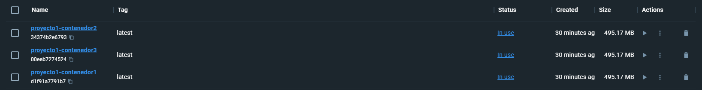
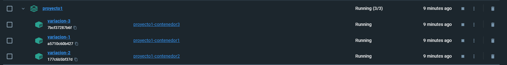

Run the same code for 3 containers with a small variation. 

Run docker compose:
```powershell
docker-compose up -d
```

Then, you'll have three images:



And three containers grouped into one supergroup:


